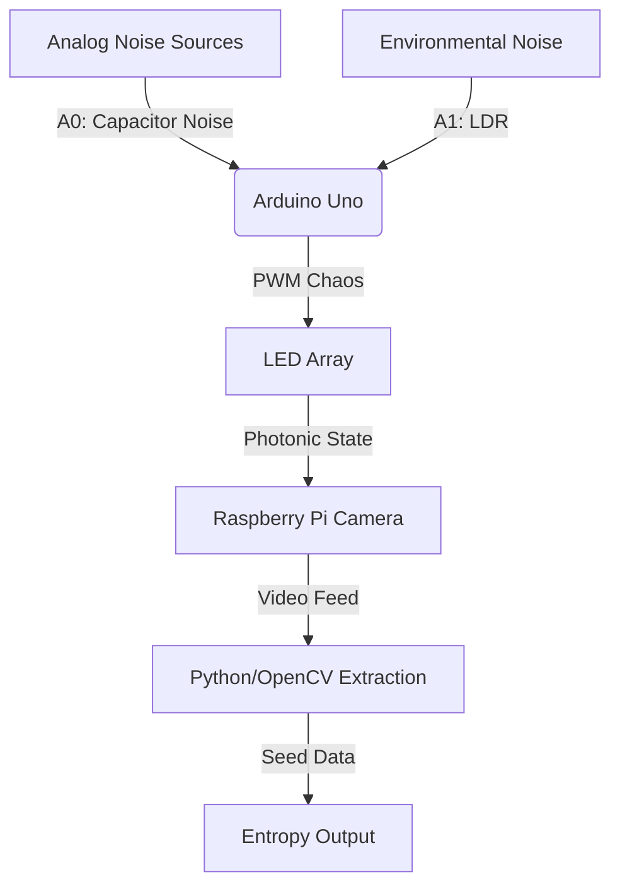

# LED-Entropy

> A hardware true random number generator inspired by Cloudflare's lava lamp wall.

## Overview

LED-Entropy generates cryptographically-useful true random numbers by combining:
- **Analog hardware noise** from capacitors and transistors
- **Environmental sensing** via photoresistors (LDRs)
- **Chaotic LED patterns** captured optically by a Raspberry Pi camera
- **Differential frame analysis** to extract unpredictable entropy

Unlike software pseudo-random number generators (PRNGs), this system derives randomness from physical phenomena that are fundamentally unpredictable.

## System Architecture

## Hardware Requirements

| Component | Specification | Purpose |
|-----------|---------------|---------|
| Arduino Uno | Rev3 or compatible | Control LEDs, read analog noise |
| LEDs | 5× standard 5mm | Create visual chaos |
| Resistors | 5× 220Ω | Current limiting |
| Capacitor | 100µF 25V polarized | Generate electrical noise (Phase 1) |
| Transistor | 2N2222A | White noise source (Phase 1) |
| Photoresistor | LDR + 10KΩ divider | Environmental light sensing (Phase 1) |
| Raspberry Pi | 3B+ or newer | Run extraction software (Phase 2) |
| Pi Camera | Module v2 | Capture LED array (Phase 2) |

## Project Status

### ✅ Phase 0 Day 1: Physical Fabrication (Current)

Setting up the base LED array on breadboard:

- [x] Project structure initialized
- [x] Wiring documentation created
- [ ] 5 LEDs distributed on breadboard
- [ ] Resistors connected to anodes
- [ ] PWM pins wired (3, 5, 6, 9, 10)
- [ ] Ground rail connected
- [ ] Proof photo captured

**See:** [Phase 0 Day 1 Checklist](docs/PHASE0_DAY1_CHECKLIST.md) | [Wiring Diagram](docs/wiring_diagram_phase0.md)

### 🔜 Upcoming Phases

- **Phase 0 Day 2:** Base system mapping (Arduino sketch)
- **Phase 1:** Hardware entropy logic (capacitor + transistor + LDR)
- **Phase 2:** Raspberry Pi camera integration
- **Phase 3:** Entropy extraction algorithm

## Quick Start

### Phase 0: Hardware Setup

1. **Gather components** (see Hardware Requirements)
2. **Follow wiring guide** in [docs/wiring_diagram_phase0.md](docs/wiring_diagram_phase0.md)
3. **Complete checklist** in [docs/PHASE0_DAY1_CHECKLIST.md](docs/PHASE0_DAY1_CHECKLIST.md)
4. **Capture proof photo** → save to `assets/phase0_breadboard.jpg`

## Documentation

| Document | Description |
|----------|-------------|
| [Wiring Diagram Phase 0](docs/wiring_diagram_phase0.md) | 5-LED breadboard schematic |
| [Phase 0 Day 1 Checklist](docs/PHASE0_DAY1_CHECKLIST.md) | Physical assembly tasks |

## License

See [LICENSE](LICENSE) for details.

---

*Inspired by [Cloudflare's LavaRand](https://blog.cloudflare.com/randomness-101-lavarand-in-production/) entropy wall.*
